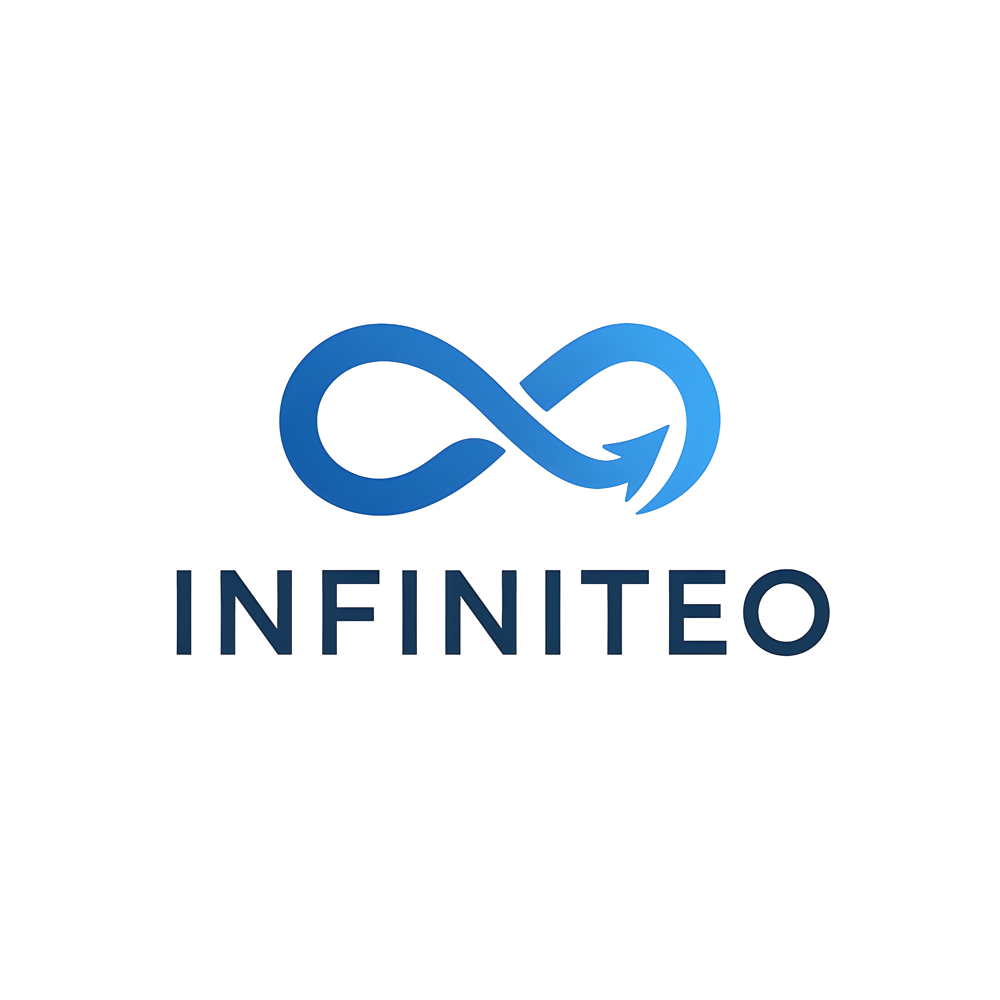

<div align="center">
  
</div>

<h1 align="center">Infiniteo: Automation Workflow Services</h1>

<div align="center">
  <p><strong>Liberate your business from archaic, manual workflows. Achieve unbounded evolution with our limitless, intuitive automation services.</strong></p>
  <p>
    <a href="https://infiniteo.tech" target="_blank"><strong>Explore the Live Site »</strong></a>
  </p>
</div>

<div align="center">
  
  
  
  
</div>

---

## 🚀 About Infiniteo

Infiniteo is the next-generation automation service partner for businesses and professionals ready to break free from manual workflows. By seamlessly integrating with every digital channel—from social content scheduling to CRM updates and custom multi-step routines—Infiniteo empowers teams of all sizes to deploy reliable, secure, and infinitely scalable solutions.

We believe every organization deserves the freedom to focus on strategic vision rather than operational drudgery. Our intuitive, platform-agnostic approach unifies fragmented processes into elegant, automated workflows, enabling you to reclaim time, drive innovation, and propel growth without compromise.

## ✨ Key Features & Services

-   **Social Media Automation:** Automate content planning, scheduling, and analytics across all social channels for consistent, impactful campaigns.
-   **Digital Platform Automation:** Connect CRMs, email, e-commerce tools, and more to synchronize data and ensure seamless operations.
-   **Custom Workflow Creation:** We design tailor-made automation sequences for your unique challenges using a suite of powerful, existing tools.
-   **Platform-Agnostic Expertise:** Our solutions are flexible, integrating seamlessly with virtually any digital channel or existing software stack.
-   **Unparalleled Reliability & Security:** We build workflows with enterprise-grade security and resilience, ensuring your critical processes run smoothly around the clock.

## 🛠️ Built With

This project is built on a modern, robust, and scalable tech stack:

-   [**Next.js**](https://nextjs.org/) - The React Framework for Production
-   [**React**](https://reactjs.org/) - A JavaScript library for building user interfaces
-   [**Tailwind CSS**](https://tailwindcss.com/) - A utility-first CSS framework
-   [**TypeScript**](https://www.typescriptlang.org/) - Typed JavaScript at Any Scale
-   [**ShadCN/UI**](https://ui.shadcn.com/) - Beautifully designed components
-   [**Genkit (for AI)**](https://firebase.google.com/docs/genkit) - The open source framework for building AI-powered apps

## 📦 Getting Started

To get a local copy up and running, follow these simple steps.

### Prerequisites

-   Node.js (v18 or later)
-   npm or yarn

### Installation & Setup

1.  **Clone the repository:**
    ```sh
    git clone https://github.com/your-username/infiniteo.org.git
    ```
2.  **Navigate to the project directory:**
    ```sh
    cd infiniteo.org
    ```
3.  **Install NPM packages:**
    ```sh
    npm install
    ```
4.  **Run the development server:**
    ```sh
    npm run dev
    ```
5.  Open [http://localhost:9002](http://localhost:9002) with your browser to see the result.

---
<p align="center">Empowering Business Evolution, Without Limits.</p>

